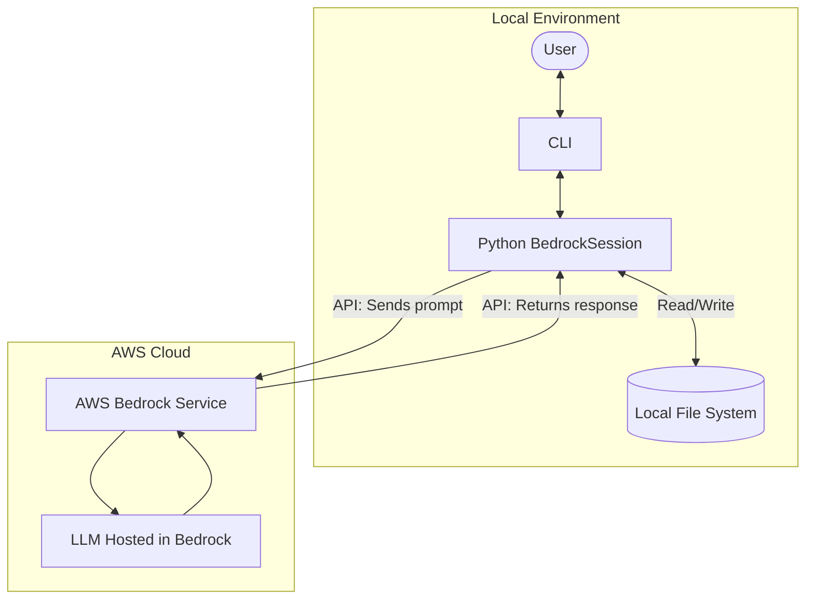

```mermaid
flowchart TD

    subgraph UserSide["Local Environment"]
        User([User])
        CLI[CLI]
        Session[Python BedrockSession]
        FS[(Local File System)]
    end

    subgraph CloudSide["AWS Cloud"]
        Bedrock[AWS Bedrock Service]
        Model[LLM Hosted in Bedrock]
    end

    User <--> CLI
    CLI <--> Session

    Session <--> |Read/Write| FS

    Session -->|API: Sends prompt| Bedrock
    Bedrock -->|API: Returns response| Session

    Bedrock --> Model
    Model --> Bedrock


```