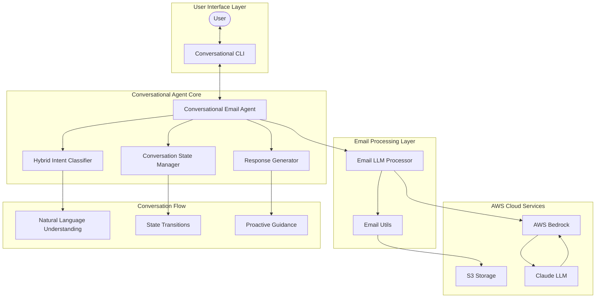

# Conversational Email Assistant Architecture

## Overview

The Email Assistant has been transformed from a command-based CLI tool into a true conversational agent that understands natural language and proactively guides users through email processing workflows.

## Architecture Diagram



## Core Components

### 1. Conversational Agent Core

#### ConversationalEmailAgent
- **Purpose**: Main orchestrator that processes user input and coordinates all components
- **Key Features**:
  - Natural language input processing
  - Intent classification and routing
  - State management and transitions
  - Response generation with proactive guidance
  - Error handling and recovery

#### Hybrid Intent Classifier
- **Purpose**: Understands user intentions from natural language input
- **Approach**: 
  - Rule-based patterns for common, clear intents (fast, reliable)
  - LLM-based classification for ambiguous or complex inputs (intelligent, flexible)
  - Context-aware adjustments based on conversation state
- **Supported Intents**:
  - `LOAD_EMAIL`: Process email content or files
  - `DRAFT_REPLY`: Create email responses
  - `EXTRACT_INFO`: Get key information from emails
  - `REFINE_DRAFT`: Modify existing drafts
  - `SAVE_DRAFT`: Export drafts to files
  - `GENERAL_HELP`: Get assistance and information
  - `CONTINUE_WORKFLOW`: Proceed with suggested next steps
  - `CLARIFICATION_NEEDED`: Handle ambiguous requests

#### Conversation State Manager
- **Purpose**: Tracks conversation flow and maintains context
- **States**:
  - `GREETING`: Initial welcome state
  - `EMAIL_LOADED`: Email content processed
  - `INFO_EXTRACTED`: Key information extracted
  - `DRAFT_CREATED`: Reply draft generated
  - `DRAFT_REFINED`: Draft has been modified
  - `READY_TO_SAVE`: Draft ready for export
  - `CONVERSATION_COMPLETE`: Workflow finished
  - `ERROR_RECOVERY`: Handling errors gracefully

#### Response Generator
- **Purpose**: Creates natural language responses with proactive guidance
- **Features**:
  - Context-aware response templates
  - Proactive workflow suggestions
  - Error handling with helpful guidance
  - Natural conversation flow maintenance

### 2. Email Processing Layer

#### Bedrock Session (Enhanced)
- **Purpose**: Handles LLM interactions and email processing operations
- **Integration**: Works seamlessly with conversational agent
- **Operations**: Email loading, information extraction, reply drafting, refinement

#### Email Utils
- **Purpose**: File handling, PDF processing, and draft saving
- **Features**: Local file operations, S3 cloud storage, PDF text extraction

### 3. User Interface Layer

#### Conversational CLI
- **Purpose**: Natural language interface instead of command-based interaction
- **Features**:
  - Conversational shell with natural input
  - Special commands (help, status, reset, exit)
  - Single-message mode for quick interactions
  - Status monitoring and conversation management

## Conversation Flow Architecture

### Natural Language Understanding (NLU)
1. **Input Processing**: User types natural language
2. **Intent Classification**: Hybrid approach determines user intent
3. **Parameter Extraction**: Relevant information extracted from input
4. **Context Integration**: Current conversation state considered

### State Transitions
1. **Current State Analysis**: Determine valid transitions
2. **Intent Validation**: Check if intent is valid for current state
3. **State Update**: Transition to new state based on successful operations
4. **Context Preservation**: Maintain conversation history and email data

### Proactive Guidance
1. **State-Based Suggestions**: Offer next logical steps
2. **Error Recovery**: Guide users through problem resolution
3. **Workflow Optimization**: Streamline common email processing tasks
4. **Natural Conversation**: Maintain conversational flow

## Data Flow

### Typical Conversation Flow
```
User Input → Intent Classification → State Validation → Operation Execution → 
State Transition → Response Generation → Proactive Guidance → User Response
```

### Email Processing Workflow
```
Email Content → Text Extraction → Information Extraction → 
Draft Generation → Refinement (optional) → Saving → Completion
```

## Key Improvements Over Previous Architecture

### From Command-Based to Conversational
- **Before**: Users had to know specific commands (`load`, `draft`, `save`)
- **After**: Users can type naturally ("Here's an email I need help with")

### From Manual to Proactive
- **Before**: Users had to explicitly trigger each step
- **After**: Agent suggests next steps and guides workflow

### From Rigid to Flexible
- **Before**: Fixed command structure with limited options
- **After**: Natural language understanding with context awareness

### From Isolated to Contextual
- **Before**: Each command was independent
- **After**: Full conversation context maintained and utilized

## Error Handling Strategy

### Graceful Degradation
1. **Intent Classification Failure**: Ask for clarification with helpful suggestions
2. **Operation Errors**: Provide specific guidance and alternative approaches
3. **Unexpected Errors**: Maintain conversation flow with friendly error messages
4. **State Recovery**: Automatic transition to error recovery state

### User Guidance
- Context-aware help suggestions
- State-specific assistance
- Natural language error explanations
- Proactive problem resolution

## Performance Considerations

### Hybrid Intent Classification
- **Rule-based**: Fast pattern matching for common cases
- **LLM-based**: Intelligent classification for complex inputs
- **Caching**: Conversation context maintained in memory
- **Optimization**: Minimal LLM calls for routine operations

### Conversation State Management
- **Lightweight**: Efficient state tracking
- **Persistent**: Context maintained throughout session
- **Scalable**: Supports long conversations and multiple emails

## Security and Privacy

### Data Handling
- **Local Processing**: Email content processed locally when possible
- **Cloud Integration**: Secure AWS Bedrock API calls
- **No Persistent Storage**: Conversation data not permanently stored
- **User Control**: Clear data handling and export options

## Future Extensibility

### Modular Design
- **Plugin Architecture**: Easy to add new intents and capabilities
- **LLM Agnostic**: Can support different LLM providers
- **Multi-Modal**: Ready for voice or GUI interfaces
- **Integration Ready**: API-friendly for external integrations