# Email Assistant Architecture

```mermaid
flowchart TD
    %% Local Components (Light Blue Background)
    subgraph LOCAL["🖥️ LOCAL ENVIRONMENT"]
        direction TB
        
        %% User Interface Layer
        USER([👤 User]) 
        CLI[📟 CLI Interface<br/>click-based commands]
        
        %% Core Processing Layer
        AGENT[🤖 Conversational Agent<br/>orchestrates workflow]
        INTENT[🎯 Intent Classifier<br/>hybrid rule/LLM-based]
        STATE[📊 State Manager<br/>conversation flow]
        RESPONSE[💬 Response Generator<br/>contextual guidance]
        
        %% Local Storage
        FILES[(📁 Local Files<br/>drafts, documents)]
    end
    
    %% Cloud Components (Light Orange Background)
    subgraph CLOUD["☁️ AWS CLOUD"]
        direction TB
        
        %% AI Services
        BEDROCK[🧠 AWS Bedrock<br/>Claude LLM]
        
        %% Storage Services
        S3[(🗄️ S3 Storage<br/>draft backups)]
    end
    
    %% Information Flow - User Interaction
    USER <==> CLI
    CLI <==> AGENT
    
    %% Information Flow - Internal Processing
    AGENT --> INTENT
    AGENT --> STATE
    AGENT --> RESPONSE
    INTENT -.-> AGENT
    STATE -.-> AGENT
    RESPONSE -.-> AGENT
    
    %% Information Flow - Cloud Services
    AGENT ==> BEDROCK
    BEDROCK ==> AGENT
    
    %% Information Flow - Storage
    AGENT --> FILES
    AGENT ==> S3
    
    %% Styling
    classDef localComp fill:#e1f5fe,stroke:#0277bd,stroke-width:2px
    classDef cloudComp fill:#fff3e0,stroke:#f57c00,stroke-width:2px
    classDef userComp fill:#f3e5f5,stroke:#7b1fa2,stroke-width:2px
    classDef storageComp fill:#e8f5e8,stroke:#388e3c,stroke-width:2px
    
    class USER userComp
    class CLI,AGENT,INTENT,STATE,RESPONSE localComp
    class BEDROCK cloudComp
    class FILES,S3 storageComp
    
    %% Legend
    subgraph LEGEND["📋 LEGEND"]
        direction LR
        L1[🖥️ Local Processing]:::localComp
        L2[☁️ Cloud Services]:::cloudComp  
        L3[👤 User Interface]:::userComp
        L4[💾 Storage]:::storageComp
    end
```

## Information Flow

### 📥 **Input Processing**
1. **User** provides email content via **CLI**
2. **CLI** forwards to **Conversational Agent**
3. **Agent** uses **Intent Classifier** to understand request
4. **State Manager** tracks conversation progress

### 🔄 **Core Processing**
1. **Agent** sends email content to **AWS Bedrock/Claude**
2. **Bedrock** processes and returns:
   - Key information extraction
   - Draft replies
   - Content refinements
3. **Agent** coordinates all operations and maintains context

### 📤 **Output & Storage**
1. **Response Generator** creates contextual user responses
2. **Agent** saves drafts to:
   - **Local Files** (default)
   - **S3 Storage** (cloud backup)
3. **CLI** presents results to **User**

